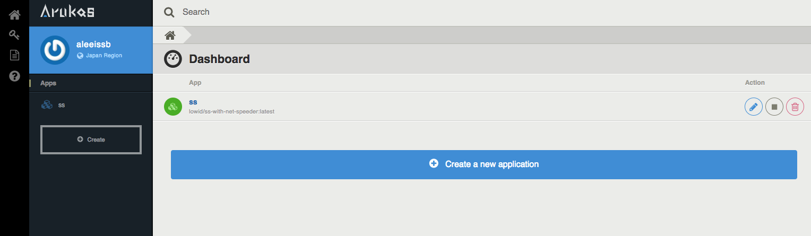
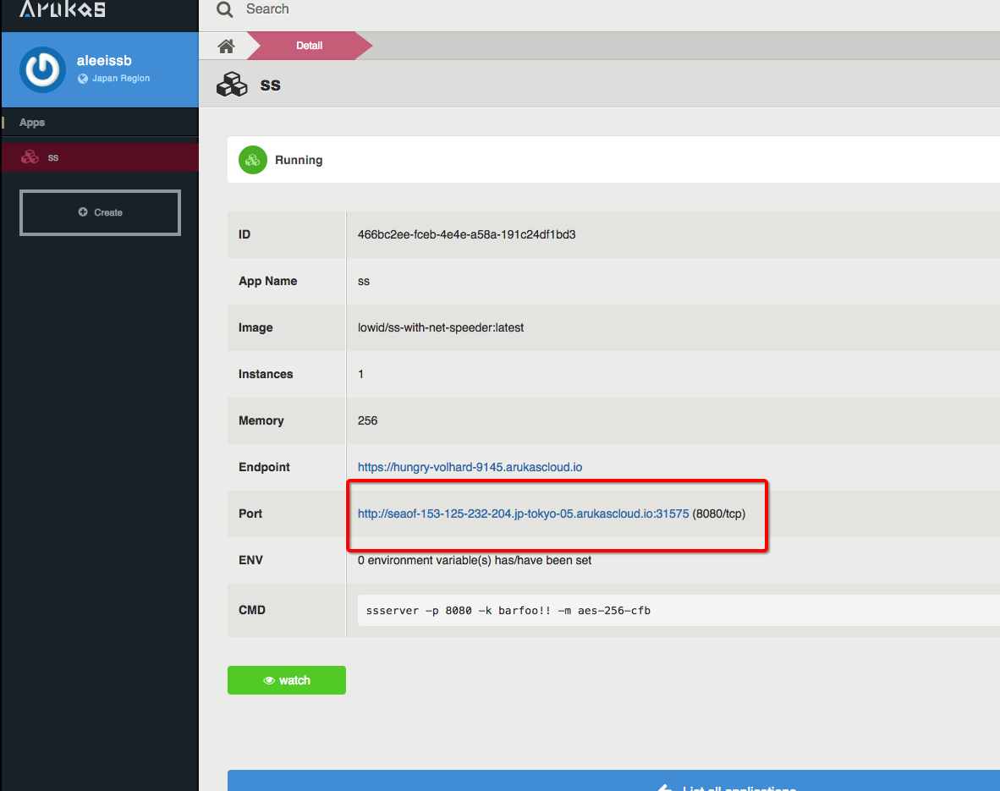
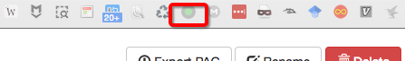
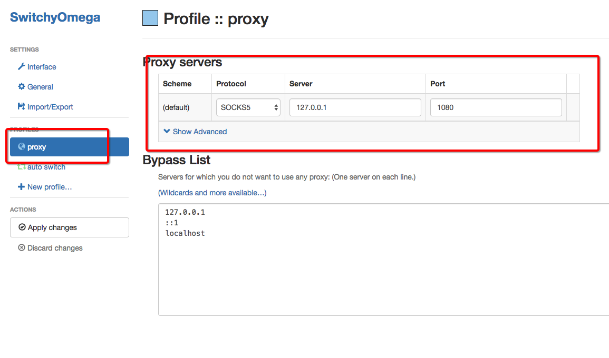
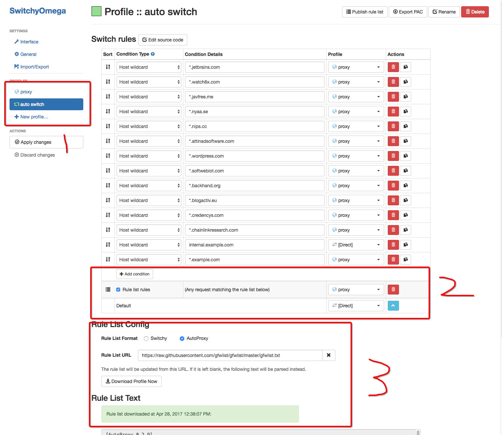
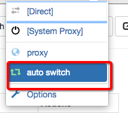

#  自助获取Shadowsocks上网服务

访问https://arukas.io

使用账户登录  

-	用户名 holdmylife@qq.com	
-	密码 Wangning1

进入Dashboard后 只有

选择SS进入

选择红框中的IP及端口，即为服务器及端口。密码为固定 barfoo！！

填写入shadowsocks中，以监听模式启动shadowsocks

---

# 自动分流插件Switchyomega的安装及使用

使用全局模式进入谷歌商店，搜索SwitchyOmega并安装。

安装后浏览器右上角产生图标

单击这个图标进入Options选项，按图示选择并填写

随之选择auto switch

选择Rule List，按图示顺序编辑

其中Rule List Config中，应该选择Autoproxy，随后填写网址

https://raw.githubusercontent.com/gfwlist/gfwlist/master/gfwlist.txt

后点击Download Profile Now，更新规则

此时配置工作已完成，单击右上角SwitchyOmega插件，选择配置好的AutoSwitch选项

对电脑右下角Shadowsocks点击右键，将全局模式切换回端口模式。

此时网站的国内外分流已基本完成
